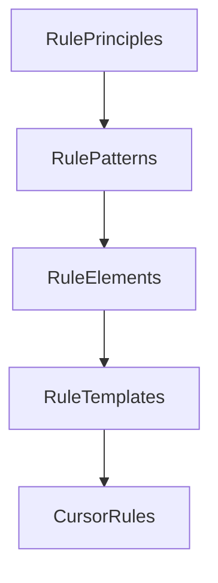

# CursorRules Component Taxonomy

## 1. RulePrinciples

Core design patterns, architectural principles, and foundational concepts that inform rule creation.

```
Examples:
- Design Patterns (Gang of Four)
- SOLID Principles
- Clean Architecture
- DRY/KISS/YAGNI
```

## 2. RulePatterns

Reusable templates or patterns that define common rule structures.

```typescript
interface RulePattern {
  type: 'structural' | 'behavioral' | 'creational';
  context: string[];
  implementation: string[];
  constraints: string[];
}
```

## 3. RuleElements

Individual components that make up a rule:

```typescript
interface RuleElement {
  id: string;
  type: 'syntax' | 'style' | 'architecture' | 'performance';
  priority: 'required' | 'recommended' | 'optional';
  context: string[];
  validation?: string;
}
```

## 4. RuleTemplates

Predefined combinations of RuleElements for common use cases:

- LanguageTemplate (TypeScript, JavaScript)
- FrameworkTemplate (React, Angular)
- PatternTemplate (Observer, Factory)

## Hierarchy



## Example Structure

CursorRules/
├── principles/           # RulePrinciples
│   ├── patterns/
│   ├── architecture/
│   └── best-practices/
├── patterns/            # RulePatterns
│   ├── structural/
│   ├── behavioral/
│   └── creational/
├── elements/            # RuleElements
│   ├── syntax/
│   ├── style/
│   └── architecture/
└── templates/           # RuleTemplates
    ├── language/
    ├── framework/
    └── pattern/

## Usage Flow

1. Select RulePrinciples
2. Choose applicable RulePatterns
3. Configure RuleElements
4. Apply RuleTemplates
5. Generate final CursorRules

## Example Composition

```typescript
// A complete rule built from components
interface CompositeRule {
  principles: RulePrinciple[];
  patterns: RulePattern[];
  elements: RuleElement[];
  template: RuleTemplate;
  output: CursorRule;
}

// Example instantiation
const reactComponentRule = {
  principles: [
    'SingleResponsibility',
    'OpenClosed'
  ],
  patterns: [
    'Presentational',
    'Container'
  ],
  elements: [
    'FunctionComponent',
    'PropTypes',
    'Hooks'
  ],
  template: 'ReactComponent',
  output: {
    // Final CursorRule format
  }
};
```

## Benefits of This Structure

1. **Modularity**
   - Easy to add new components
   - Mix and match elements
   - Reusable patterns

2. **Clarity**
   - Clear hierarchy
   - Defined relationships
   - Structured composition

3. **Maintainability**
   - Isolated updates
   - Version control
   - Clear dependencies

4. **Extensibility**
   - New principles
   - New patterns
   - New templates

5. **Validation**
   - Pattern compliance
   - Principle adherence
   - Template consistency
